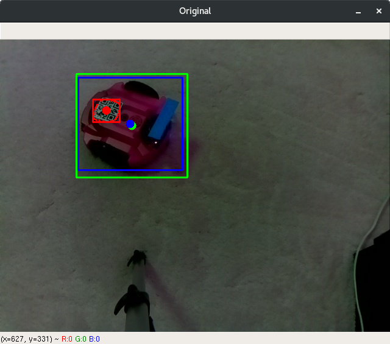

# modelComparer

A bunch of utility Python scripts used for analyzing object detector performance.

## How it works

When training supervised image classifiers, a sufficently large sample of labeled images must be built. I used a simple image mask utility that created `.xml` files with the position of every bounding box. These images can then be passed back through the detector to evaluate performance.

## Why this is so janky

The majority of this was written several years ago when I was still learning python. I have tried to update some, but due to how poorly I documented this originally, I lost a lot of progress.
